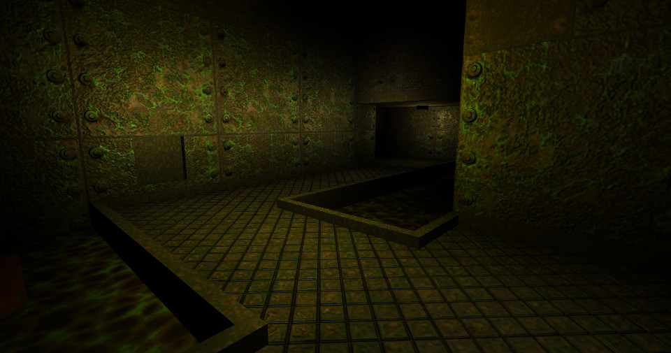
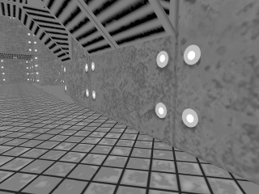
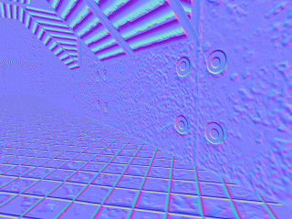
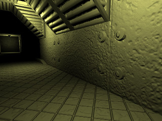
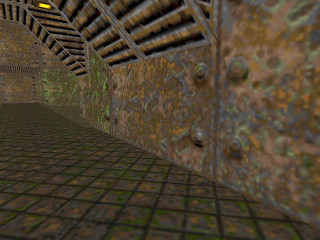
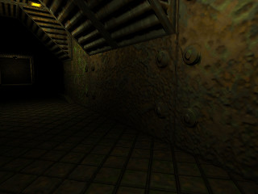

Quake2.jl
=========

Quake 2 graphics engine written with [Julia](http://julialang.org/) and modern OpenGL.

Features
--------

* Map (.bsp) rendering
* Per-pixel lighting
* Support for bump and parallax effects from heightmaps

Lighting
--------

Traditional [Phong shading](https://en.wikipedia.org/wiki/Phong_shading) is applied per-pixel and used in conjunction with point lights parsed from the BSP's entity list. Lightmaps baked into the BSP are not currently being used due to their low resolution and lack of direction information.

Bump and parallax effects can be created by providing an optional height map. Normal maps are calculated automatically from the height map at initialization.

The bump and parallax effects breathe new life into the original, low resolution Quake 2 textures.

